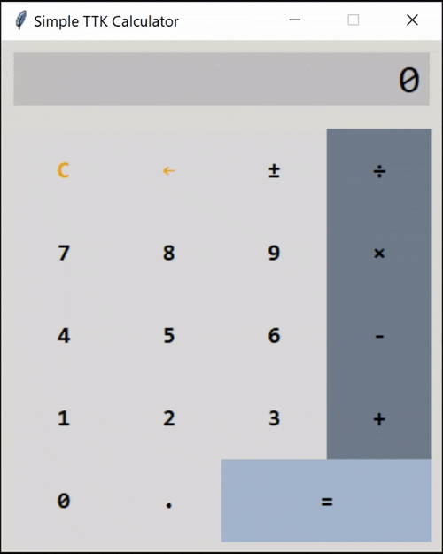

# Simple TTK Calculator Manual

A plain and straightforward implementation of a simple desk calculator.

## Features

- Support of integers and decimals with a precision of up to 15 digits
- Addition (`+`), subtraction (`-`), multiplication (`×`) and division (`÷`)
  of two numbers
- Short evaluation (e.g. a sequence of button presses consisting of 
  `9` `×` `=` will be translated to `9` `×` `9` `=`)
- Result of a calculation can be automatically used as a first operand
  of the next calculation (e.g. key sequence `9` `×` `9` `=` `+` `9` `=`
  will yield `90`)
- Inversion of a sign of the currently displayed number (`±`)
- Correction / removal of last digit of the currently displayed number (`←`)
- Reset of the calculator (e.g. after an error) is done via (`C`) button

## User Interaction

Calculator can be operated by a mouse (left-click on the desired calculator
button) or through a keyboard (see the [Key Bindings](#key-bindings) chapter).

## Calculation Errors

There are basically three types of error a user can encounter

- Overflow errors are reported by "**Number too large**" message on the display. This
  means the result of the calculation contains more significant digits, than it
  can be shown.
- Underflow errors are reported by "**Number too small**" message on the display. This
  means the result of the calculation is a decimal number too small to be represented
  even by all digits the calculator is capable of showing.
- Division by zero error is reported through "**Division by 0**" message on the display.
- General purpose error reported simply as "**Unknown error**" is displayed in case of an
  unexpected error (i.e. most likely unexpected calculator state due to a bug
  in the program).

The only way to recover from any error is to perform a calculator reset by pressing
the `C` button.

## Key Bindings

First column of every table in this chapter represents the key on the calculator's
keypad, the second column contains a comma separated list of keys on your computer's
keyboard.

Please note that keys on the dedicated numeric part of your keyboard may not work
properly or at all.

### Digits

| Digit Character | Key Bindings |
|-----------------|--------------|
| `1`             | `1`          |
| `2`             | `2`          |
| `3`             | `3`          |
| `4`             | `4`          |
| `5`             | `5`          |
| `6`             | `6`          |
| `7`             | `7`          |
| `8`             | `8`          |
| `9`             | `9`          |
| `0`             | `0`          |
| `.`             | `.`, `,`     |
| `±`             | `S`, `s`     |

### Control Keys

| Control Key | Key Bindings                  |
|-------------|-------------------------------|
| `C`         | `C`, `c`, `<Delete>`          |
| `←`         | `<Backspace>`, `<Left Arrow>` |
| `=`         | `=`, `<Enter>`                |

### Operators

| Operator | Key Bindings |
|----------|--------------|
| `+`      | `+`          |
| `-`      | `-`          |
| `×`      | `*`          |
| `÷`      | `/`          |
